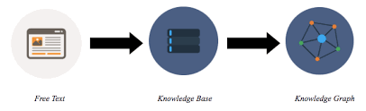

# ChatGPT API

```python
from typing import Dict
from langchain.prompts import PromptTemplate
from langchain.llms import OpenAI
from langchain.chains import LLMChain

chatgpt = OpenAI(openai_api_key='openai_api_key', temperature=0.1, model_name='gpt-3.5-turbo')


def text_reasoning(prompt_text: str, inputs: Dict, verbose: bool = True) -> str:
    """
    A function that uses large language model like gpt3.5 to do text reasoning.
    Args:
        verbose: Show the debug messages or not.
        prompt_text: A string.
        inputs: A dict that contains keywords in prompt.

    Returns:
        A string that indicates the text reasoning result.
    """
    prompt = PromptTemplate.from_template(prompt_text)

    chain = LLMChain(llm=chatgpt, prompt=prompt, verbose=verbose)
    response = chain.run(inputs)

    return response.strip()
```

    

